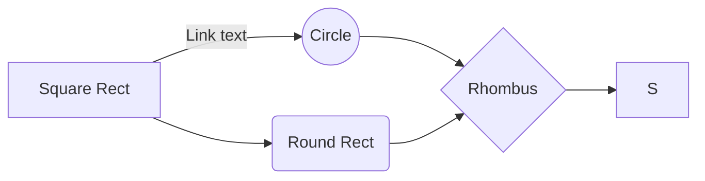

Before you watch each problems, please check http://rosalind.info/problems/tree-view/.
<<<<<<< HEAD
 
The link above will provide overall all **TREE** of **Bioinformatic Stronghold Problems**.  
The **LEVEL** is the **degree** of the problem tree.
=======

>>>>>>> 501de398d6f6f93500dbabc5b9275bebe950fae2
